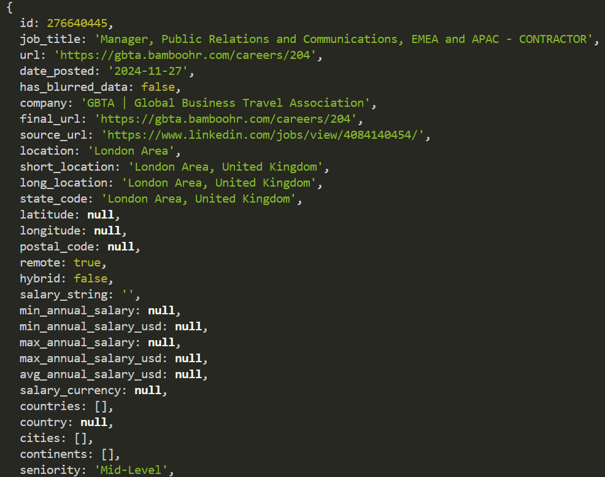
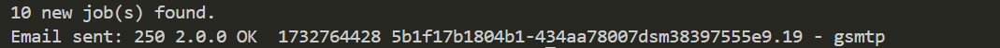
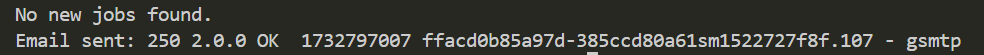
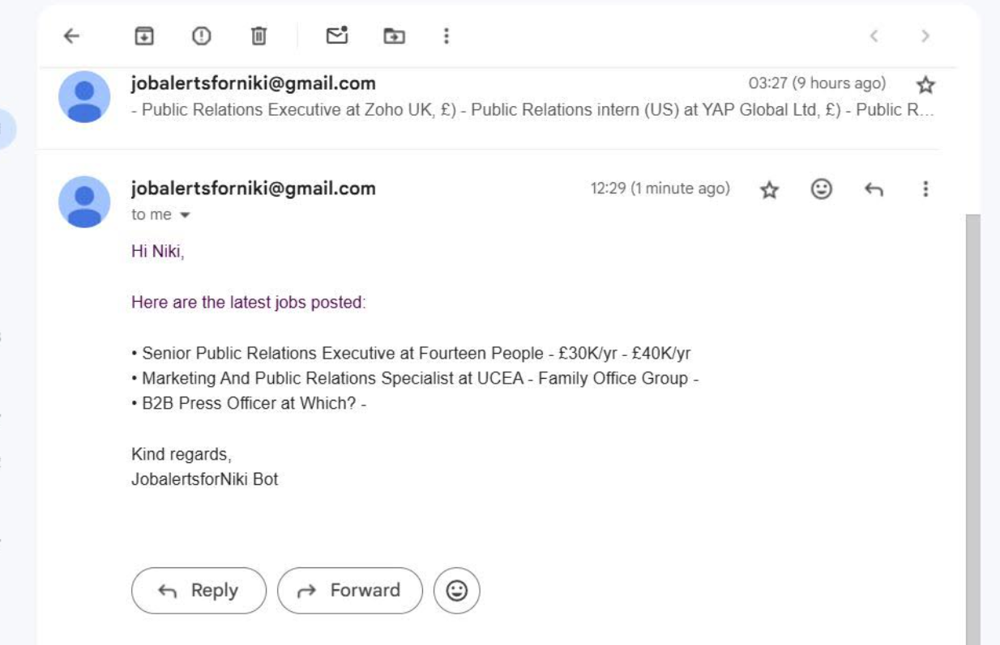
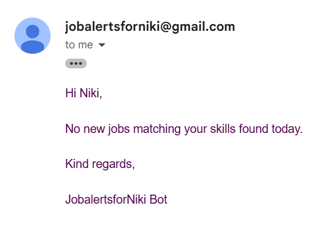

# JobalertsforNiki
New jobs alerts I created for my girlfriend, script sends an email to recipient, interval can be adjusted - node.js

**jobsalertforniki** is a script designed to provide real-time alerts for job opportunities tailored to specific criteria. This tool can be customized to streamline your job search by sending notifications when matching jobs are posted.

## Features
- Fetches job postings from TheirStack API - pulls jobs from multiple different companies, can be adjust in "payload.json"
- Filters jobs based on predefined criteria (eg. keywords: job title, company location, salary). <br> Please visit https://theirstack.com/en/job-posting-api, search with filters and copy their json api and paste into "payload.json".
- Sends alerts via email.
- Can setup the interval at which it runs script, either host on your device or use a site like Heraku or Railway, to host the script and run at intervals set
- User-friendly configuration for quick setup and customization.

## Installation
1. Clone this repository:
   ```npm
   git clone https://github.com/ArifAlee/JobsalertforNiki.git
   
2. Install dependencies:
   ```npm
   npm install  # node-mailer, node-fetch@2

## Usage
1. Run the script with
   ```npm
   node jobalert.js

## Configuration
1. Set job filters - visit https://theirstack.com/en/job-posting-api, you can create filters there and copy their api code and paste it into payload.json
2. Configure API authorisation - "Bearer <your token>"
3. Set up sendEmail() and noNewJobs(), with your email and password, having gmail's "app password" enabled is easier to (2FA required for this method)
4. set up maiOptions, personalise your email

## Below are some screenshots of the working app and it's results

1. Response in terminal when script runs


3. Jobs found and email sent



4. No jobs found and email sent



5. Gmail mail received alerting new job postings



7. Gmail mail received alerting no new jobs matching skillset was found



